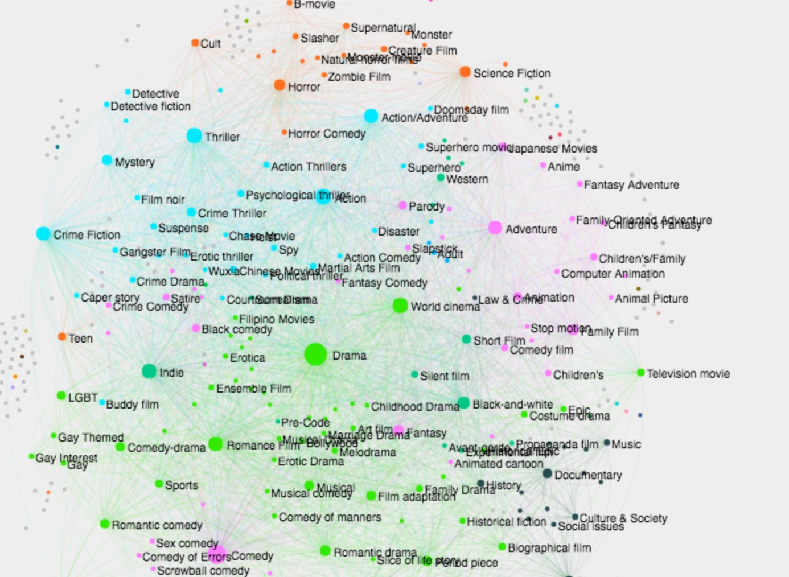

# Movies Project
Final project for CS249, Spring 2016

Exploratory data analysis of the CMU Movies corpus: [http://www.cs.cmu.edu/~ark/personas/
](http://)

My re-formatted pickle file, combining movie metadata, character metadata, and summaries (132MB): 
[https://drive.google.com/file/d/0BzuUXoRjB9NreUhkQ0YxMFdGSHM/view?usp=sharing ](http://)

#### Questions to answer:

- ~~What is the relationship between box office revenue and genre?~~ (See genre_revenue.svg)

-  ~~What are the most common intersections between genres?~~
(Complete. Created a Genre Explorer with weighted labels. See genre_intersections.py)
The explorer is at [cs.wellesley.edu/mokeefe2/cs249/genres]()

-  ** Gender representation in film:** What is the average age of the male/female lead over time (line chart)? What is the ratio between male/female actors across different genres (multi pie-chart)? 

- **Basic text analysis of plot summaries:** which phrases are more likely to produce a top-grossing film? 

#### Process goals / new things to learn
- Given that this data is very text-heavy with few continuous variables, for this project I'm going to use dictionaries/pickle files rather than Pandas.
Goal is to wrangle the tsv files in the original dataset to suit my needs. (**complete: **see `compile_data.py`)
 
- To learn visualizations with Pygal for the first time. Pygal's interactive SVGs have the added benefit of being easily embeddable in an HTML page, which I'm going to create at the end to share my findings. (see `do_pygal.py` and the `out` directory for sample charts)

- To spend a little bit of time getting better with manipulating networks in Gephi, so that the modularity groups get closer together (**complete:** see genre explorer and `genre_intersections.py` for the process). 